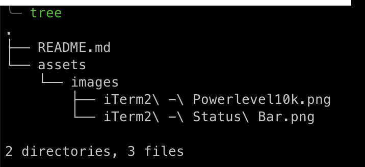

# BigMac <!-- omit in toc -->

Personal macOS setup for software development.

- [macOS](#macOS)
  - [Finder](#finder)
    - [Show Path and Status Bars](#show-path-and-status-bars)
  - [Alfred (Spotlight Replacement)](#alfred-spotlight-replacement)
    - [Disabling Spotlight Hotkey](#disabling-spotlight-hotkey)
    - [Enable Alfred Hotkey](#enable-alfred-hotkey)
    - [Show Alfred on Mouse Screen](#show-alfred-on-the-mouse-screen)
    - [Clipboard History](#clipboard-history)
    - [Theme](#theme)
    - [Workflows](#workflows)
  - [Key Shortcuts](#key-shortcuts)
    - [System Wide](#system-wide)
    - [Windows Management](#windows-management)
    - [Finder](#finder-1)
    - [Screenshots](#screenshots)
- [Terminal](#terminal)
  - [Homebrew](#homebrew)
    - [Useful Commands](#useful-commands)
  - [iTerm2](#iterm2)
    - [Key Shortcuts](#key-shortcuts-1)
    - [Hotkey Window](#hotkey-window)
    - [Appearance](#appearance)
    - [Unlimited Scrollback](#unlimited-scrollback)
    - [Setting Key Bindings](#setting-key-bindings)
    - [Status Bar](#status-bar)
    - [Shell Integration](#shell-integration)
    - [Triggers](#triggers)
  - [Git](#git)
  - [ZSH](#zsh)
    - [Oh My ZSH](#oh-my-zsh)
      - [Themes](#themes)
      - [Oh My ZSH Plugins](#oh-my-zsh-plugins)
    - [ZSH Plugins](#zsh-plugins)
  - [tldr](#tldr)
  - [tree](#tree)
  - [htop](#htop)
  - [fzf](#fzf)
    - [Examples](#examples)
  - [ripgrep](#ripgrep)
  - [lnav](#lnav)
- [Browsers](#browsers)
  - [Firefox](#firefox)
    - [Add-ons](#add-ons)
  - [Setting Default Browser](#setting-default-browser)
- [Development](#development)
  - [Docker](#docker)
  - [Visual Studio Code](#visual-studio-code)
    - [Extensions](#extensions)
      - [Theme](#theme-1)
      - [Java](#java)
      - [JavaScript](#javascript)
      - [Markdown](#markdown)
      - [Miscellaneous](#miscellaneous)
- [Security](#security)
  - [LastPass](#lastpass)
- [Languages](#languages)
  - [Java](#java-1)
  - [Python](#python)
    - [Anaconda](#anaconda)
      - [Useful Commands](#useful-commands-1)
  - [Node](#node)
    - [Installation](#installation)
    - [Useful Commands](#useful-commands-2)
- [Productivity](#productivity)
  - [Spark](#spark)
    - [Notification Badges](#notification-badges)
  - [Things 3](#things-3)
    - [Things Cloud](#things-cloud)
  - [Bear](#bear)
  - [Trello](#trello)
- [Miscellaneous](#miscellaneous-1)
  - [Unsplash Wallpapers](#unsplash-wallpapers)
  - [AppCleaner](#appcleaner)

---

## macOS

### Finder

#### Show Path and Status Bars

`Finder > View > Show Path Bar`  
`Finder > View > Show Status Bar`

### Alfred (Spotlight Replacement)

Alfred is a very capable Spotlight replacement. It offers same features as Spotlight but also offers a wide range of additional features. It's a free app, but most nice features require a Powerpack which comes with a one time cost.

```bash
brew cask install alfred
```

#### Disabling Spotlight Hotkey

`macOS > System Preferences > Spotlight > Keyboard Shortcuts > Uncheck Show Spotlight Search`  
`macOS > System Preferences > Spotlight > Keyboard Shortcuts > Uncheck Show Finder Search Window`

#### Enable Alfred Hotkey

`Alfred Preferences > General > Change Hotkey to ⌘ + Space`

#### Show Alfred on the Mouse Screen

`Alfred Preferences > Appearance > Options > Show Alfred on "mouse screen"`

#### Clipboard History

`Alfred Preferences > Features > Clipboard History > ☑️ Keep Plain Text`

Add any sensitive apps to the ignored apps section.

#### Theme

`Alfred Preferences > Appearance > Modern Avenir`

#### Workflows

To be added soon.

### Key Shortcuts

#### System Wide

| Shortcut  | Action            |
| :-------- | :---------------- |
| ⌘ Space   | Spotlight/Alfred  |
| ^ ⌘ Space | Character Viewer  |
| ⌥ ⌘ Space | Clipboard History |
| ⌥ ⌘ Esc   | Force Quit App    |
| ^ ⌘ Q     | Lock Screen       |

#### Windows Management

| Shortcut | Action           |
| :------- | :--------------- |
| ^ ↑      | Show All Windows |
| ^ →      | Next Window      |
| ^ ←      | Previous Window  |
| ⌘ Tab    | Rotate Windows   |

<!-- markdownlint-disable MD024 -->

#### Finder

| Shortcut | Action                   |
| :------- | :----------------------- |
| ⇧ ⌘ H    | Go to Home Directory     |
| ⇧ ⌘ D    | Go to Desktop Directory  |
| ⇧ ⌘ .    | Show Hidden Files        |
| ⌘ ↑      | Go to Parent Directory   |
| ⌘ ]      | Go to Next Directory     |
| ⌘ [      | Go to Previous Directory |

#### Screenshots

| Shortcut | Action                                  |
| :------- | :-------------------------------------- |
| ⇧ ⌘ 3    | Take Screenshot of the Full Screen      |
| ⇧ ⌘ 4    | Take Screenshot of a Part of the Screen |

---

## Terminal

### [Homebrew](https://brew.sh/)

Homebrew is a very useful macOS package manager which can be accessed from terminal.

To install it open terminal and run this command:

```bash
/bin/bash -c "$(curl -fsSL https://raw.githubusercontent.com/Homebrew/install/master/install.sh)"
```

#### Useful Commands

- **brew doctor**: verify installation of Homebrew.
- **brew search**: search for available packages on Homebrew.
- **brew install**: installs command line tools.
- **brew cask install**: installs macOS applications.
- **brew list**: lists installed command line tools.
- **brew cask list**: lists installed macOS applications.
- **brew update**: updates local package registry.
- **brew upgrade**: upgrade all installed packages.
- **brew cleanup**: clean broken symlinks

### [iTerm2](https://www.iterm2.com/index.html)

iTerm2 is arguably the best terminal replacement. It offers a wide range of very useful features.

To install iTerm2 open terminal and run this command:

```bash
brew cask install iterm2
```

#### Key Shortcuts

| Shortcut | Action                     |
| :------- | :------------------------- |
| ⌘ ,      | Preferences                |
| ⌘ Enter  | Go Full Screen             |
| ⌘ T      | New Tab                    |
| ⌘ ←      | Previous Tab               |
| ⌘ →      | Next Tab                   |
| ⎇ ⌘ ↑/↓  | Go to next Horizontal Pane |
| ⎇ ⌘ ←/→  | Go to next Vertical Pane   |
| ⎇ ⌘ B    | Instant Replay Mode        |

#### Hotkey Window

Show and hide iTerm2 terminal using a hotkey. This can be done by following the below steps:

1. `iTerm2 > Preferences > Profiles > Select Profile > Window > Style - Full-Width Top of Screen`
2. `iTerm2 > Preferences > Profiles > Select Profile > Window > Screen - Screen with Cursor`
3. `iTerm2 > Preferences > Profiles > Select Profile > Window > Space - All Spaces`
4. `iTerm2 > Preferences > Profiles > Select Profile > Keys > ☑️  A hotkey opens a dedicated window with this profile > Configure Hotkey Window > Add Hotkey`
5. `iTerm2 > Preferences > Appearance > ☑️  Exclude from Dock and ⌘-Tab Application Switcher`

#### Appearance

Optionally set some default appearance settings by following the below:
`iTerm2 > Preferences > Appearance > General > Theme > Dark`  
`iTerm2 > Preferences > Appearance > General > Tab Bar Location > Left`

#### Unlimited Scrollback

`iTerm2 > Preferences > Profiles > Select Profile > Terminal > Scrollback Lines > ☑️ Unlimited Scrollback`

#### Setting Key Bindings

You can set key bindings by going to `iTerm2 > Preferences > Profiles > Select Profile > Keys > Key Binding`

Some useful key bindings can be viewed in the table below:

| Shortcut | Action                       |
| :------- | :--------------------------- |
| ⎇ H      | Split Panes Horizontally     |
| ⎇ V      | Split Panes Vertically       |
| ⎇ ←      | Send Escape Sequence `Esc+b` |
| ⎇ →      | Send Escape Sequence `Esc+f` |

#### [Status Bar](https://www.iterm2.com/documentation-status-bar.html)

iTerm2 also supports adding a status bar with nice looking widgets for CPU, Memory, Battery, Clock, Search Bar and more. You can configure the status bar by:
``iTerm2 > Preferences > Profiles > Select Profile > Session > ☑️ Status Bar Enabled > Configure Status Bar``


#### [Shell Integration](https://www.iterm2.com/documentation-shell-integration.html)

Shell integration offers better integration with Shell and enables features like:

1. Access to frequently used directories.
2. Automatic profile switching based on host names or user profiles.

You can enable shell integration by running:

```bash
curl -L https://iterm2.com/shell_integration/zsh -o ~/.iterm2_shell_integration.zsh
source ~/.iterm2_shell_integration.zsh
```

#### [Triggers](https://www.iterm2.com/documentation/2.1/documentation-triggers.html)

Triggers are custom user defined actions that gets triggered based on a regular expression match in the command history. They can be used, among other uses, to:

1. Stop scrolling on a specific line matching a regular expression. (e.g. stop on test failures).
2. Color highlight custom text (e.g. URLs).
3. Automatically respond to prompts.
4. Send notification when a specific output is returned.

You can set triggers by going to `iTerm2 > Preferences > Profiles > Select Profile > Advanced > Triggers > Edit`

In addition to the above features, iTerm2 has a [wide range of features](https://www.iterm2.com/features.html) that might be of interest.

### [Git](https://git-scm.com/)

Popular tool used for version control.

Homebrew will require installation of XCode CommandLine Tools, and that normally installs git. But if you need to install it using brew:

```bash
brew install git
```

Configure Git by editing `~/.gitconfig` file:

```bash
[user]
        name = Hisham Elbaz
        email = hisham.elbaz@babylonhealth.com
[alias]
        graph = log --graph --abbrev-commit --decorate --format=format:'%C(bold blue)%h%C(reset) - %C(bold cyan)%aD%C(reset) %C(bold green)(%ar)%C(reset)%C(bold yellow)%d%C(reset)%n''          %C(white)%s%C(reset) %C(dim white)- %an%C(reset)' --all
```

### [ZSH](https://www.zsh.org/)

ZSH is an advanced shell built on top of Bash that offers a wide range of useful features including:

- **Tab Completion**: Press `Tab` to autocomplete commands.
- **Glob**: Use wildcards to list all possible options, for example `ls file_*`

It comes as the default shell with Catalina, but for earlier versions you can install it by running:

```bash
brew install zsh
sudo sh -c 'echo /usr/local/bin/zsh >> /etc/shells'
chsh -s /usr/local/bin/zsh
```

#### [Oh My ZSH](https://ohmyz.sh/)

Oh My ZSH is a framework that manages ZSH shell configurations. It offers an easy and very useful way to add plugins and themes among other features.

To install:

```bash
sh -c "$(curl -fsSL https://raw.github.com/ohmyzsh/ohmyzsh/master/tools/install.sh)"
```

This will update ZSH preferences by overwriting `~/.zshrc`. Below are some customization that can be applied to that file to support different features.

##### Themes

To update theme you have to set `ZSH_THEME` to the theme name. You can find an extensive list of themes [here](https://github.com/ohmyzsh/ohmyzsh/wiki/Themes)

Color Themes:

- [**Dracula**](https://draculatheme.com/iterm)

  ```bash
  git clone https://github.com/dracula/iterm.git
  ```

  `iTerm2 > Preferences > Profiles > Select Profile > Colors > Import Dracula.itermcolors`  
  `iTerm2 > Preferences > Profiles > Select Profile > Colors > Select Dracula`

Themes:

- [**Powerlevel10k**](https://github.com/romkatv/powerlevel10k)

  ```bash
  brew install romkatv/powerlevel10k/powerlevel10k
  echo "source /usr/local/opt/powerlevel10k/powerlevel10k.zsh-theme" >> ~/.zshrc
  p10k configure
  ```

  

- [**Spaceship**](https://github.com/denysdovhan/spaceship-prompt)

  ```bash
  git clone https://github.com/denysdovhan/spaceship-prompt.git "$ZSH_CUSTOM/themes/spaceship-prompt"
  ln -s "$ZSH_CUSTOM/themes/spaceship-prompt/spaceship.zsh-theme" "$ZSH_CUSTOM/themes/spaceship.zsh-theme"
  ```

  Then set `ZSH_THEME="spaceship"` in your `~/.zshrc`

##### Oh My ZSH Plugins

- [**alias-finder**](https://github.com/ohmyzsh/ohmyzsh/tree/master/plugins/alias-finder): finds an alias for a given command.
- [**common-aliases**](https://github.com/ohmyzsh/ohmyzsh/tree/master/plugins/common-aliases): adds a wide list of common aliases.
- [**copydir**](https://github.com/ohmyzsh/ohmyzsh/tree/master/plugins/copydir): copies current directory path to clipboard.
- [**copyfile**](https://github.com/ohmyzsh/ohmyzsh/tree/master/plugins/copyfile): copies content of a file to clipboard.
- [**docker**](https://github.com/ohmyzsh/ohmyzsh/tree/master/plugins/docker): adds autocompletion for docker commands.
- [**dotenv**](https://github.com/ohmyzsh/ohmyzsh/tree/master/plugins/dotenv): loads environment variables from .env file in a directory.
- [**extract**](https://github.com/ohmyzsh/ohmyzsh/tree/master/plugins/extract): tool to support extracting all types of compressed files.
- [**git**](https://github.com/ohmyzsh/ohmyzsh/tree/master/plugins/git): adds useful aliases for git commands.
- [**z**](https://github.com/ohmyzsh/ohmyzsh/tree/master/plugins/z): provide quick access to most recently accessed directories.

#### ZSH Plugins

- [**zsh-auto-suggestions**](https://github.com/zsh-users/zsh-autosuggestions): suggests commands as you type based on history and completions.

  ```bash
  brew install zsh-autosuggestions
  echo "source /usr/local/share/zsh-autosuggestions/zsh-autosuggestions.zsh" >> ~/.zshrc
  ```

- [**zsh-syntax-highlighting**](https://github.com/zsh-users/zsh-syntax-highlighting): highlights commands in ZSH terminal.

  ```bash
  brew install zsh-syntax-highlighting
  echo "source /usr/local/share/zsh-syntax-highlighting/zsh-syntax-highlighting.zsh" >> ~/.zshrc
  ```

- [**zsh-history-substring-search**](https://github.com/zsh-users/zsh-history-substring-search): auto completes commands from history based on substrings.

  ```bash
  brew install zsh-history-substring-search
  echo "source /usr/local/share/zsh-history-substring-search/zsh-history-substring-search.zsh" >> ~/.zshrc
  ```

  To be able to use, a key must be bound to the feature, it's recommended to use **up arrow** as below:

  ```bash
  echo "bindkey '^[OA' history-substring-search-up" >> ~/.zshrc
  echo "bindkey '^[OB' history-substring-search-down" >> ~/.zshrc
  ```

### [tldr](https://github.com/tldr-pages/tldr)

Simplified and community driven man-pages.

```bash
brew install tldr
```

### tree

A recursive directory listing command that produces a depth indented listing of files.

```bash
brew install tree
```



### [htop](https://linux.die.net/man/1/htop)

An advanced `top` command that allows scrolling.

```bash
brew install htop
```

### [fzf](https://github.com/junegunn/fzf)

A fuzzy search command line tool that allows interactive searching in any kinds of lists.

```bash
brew install fzf
```

#### Examples

- `ls | fzf`
- `find . -type f | fzf`

### [ripgrep](https://github.com/BurntSushi/ripgrep)

A recursive grep command that runs on a directory of files.

```bash
brew install ripgrep
```

### [lnav](http://lnav.org)

A log analysis tool that merges log files, detect their formats and allow advanced searching on them.

```bash
brew install lnav
```

---

## Browsers

### [Firefox](https://www.mozilla.org/en-GB/firefox/new/)

Firefox is one of the best browsers out there. Some of the very useful features are:

- **Add-ons**: very rich store of add-ons that can be added to the browser.
- **Firefox Monitor**: monitors breaches for user email accounts to promptly notify the user to act quickly.

```bash
brew cask install firefox
```

#### Add-ons

- **LastPass**: password manager extension to fill in forms.
- **JSONView**: viewer for JSON objects.

### Setting Default Browser

`macOS > System Preferences > General > Default web browser`

---

## Development

### [Docker](https://www.docker.com/)

```bash
brew cask install docker
```

### [Visual Studio Code](https://code.visualstudio.com)

IDE that has the largest community support, with support to all mainstream languages and frameworks.

```bash
brew cask install visual-studio-code
```

#### Extensions

##### Theme

- **Atom One Dark Theme**: a dark but vibrant theme.
- **vscode-icons**: custom icons for most supported extensions.

##### Java

- **Language Support for Java**: Java linting, intellisense, formatting and Gradle/Maven support.
- **Lombok Annotations Support**: support for lombok generators in Java.

##### JavaScript

- **npm**: supports running npm scripts in VSCode.
- **npm intellisense**: autocompletion for npm modules.
- **Jest**: support for Jest testing framework.
- **ESLint**: integrates linting for JavaScript.

##### Markdown

- **Markdown All in One**: adds very useful Markdown features like; Table of Contents, Key Shortcuts and Formatting.
- **markdownlint**: adds support for linting in Markdown.

##### Miscellaneous

- **Prettier**: code formatter that uses Prettier framework.
- **Bracket Pair Colorizer**: colors corresponding pair for better readability.
- **Better Comments**: human friendly comments in the code by adding hinting, colors and visibility.
- **Gitlens**: great extension for improving git and source control capabilities.
- **Partial Diff**: enables running diff on clipboard, partial code and files.
- **Path Intellisense**: adds autocompletion for paths.
- **Code Spell Checker**: hints for spelling mistakes.
- **Docker**: support for Docker files and images.

---

## Security

### [LastPass](https://www.lastpass.com/)

LastPass is a password manager that can safely store and sync your passwords. [AppStore Link](https://apps.apple.com/gb/app/lastpass-password-manager/id926036361?mt=12)

---

## Languages

### Java

Install latest LTS JDK, currently 11.

```bash
brew tap homebrew/cask-versions
brew cask install java11
```

### Python

macOS Catalina comes by default with Python2.7 support, installing XCode command line tools gives support to Python3 as well.

Alternatively you can install python using Homebrew:

```bash
brew install python
```

#### Anaconda

Anaconda is a very powerful package and environment manager for Python, and is widely used for science projects on Python.

```bash
brew cask install anaconda
echo "export PATH=$PATH:/usr/local/anaconda3/bin" >> ~/.zshrc
conda init zsh
```

##### Useful Commands

- **conda activate**: activate default python environment.
- **conda activate [environment]**: activate given python environment.
- **conda deactivate**: deactivates the environment.
- **conda create --name [environment]**: creates a new environment.
- **conda install [package]**: installs the given package.
- **conda remove [package]**: removes the given package.
- **conda update [package]**: updates the given package.
- **conda list**: lists all installed packages in the activated environment.

### Node

The recommended way to install Node is through Node Version Manager (nvm) which allows installation of multiple Node versions and changing them easily.

#### Installation

```bash
brew install nvm
mkdir ~/.nvm
```

Then add the following to `~/.zshrc`:

```bash
export NVM_DIR="$HOME/.nvm"
[ -s "/usr/local/opt/nvm/nvm.sh" ] && . "/usr/local/opt/nvm/nvm.sh"
[ -s "/usr/local/opt/nvm/etc/bash_completion.d/nvm" ] && . "/usr/local/opt/nvm/etc/bash_completion.d/nvm"
```

#### Useful Commands

- **nvm ls**: list installed node versions.
- **nvm install [node-version]**: install provided node version.
- **nvm use [node-version]**: use provided node version.

---

## Productivity

### [Spark](https://sparkmailapp.com/)

Spark is a very powerful email client, that in addition to looking good provides lots of nice features. [AppStore Link](https://apps.apple.com/gb/app/spark-email-app-by-readdle/id1176895641?mt=12)

#### Notification Badges

`Spark > Preferences > Notifications > Badges > Enable Dock Icon Badge - New Messages Only`

### [Things 3](https://apps.apple.com/gb/app/things-3/id904280696?mt=12)

Award winning task manager for organising tasks and projects. [AppStore Link](https://apps.apple.com/gb/app/things-3/id904280696?mt=12)

#### Things Cloud

`Things > Preferences > Things Cloud`

### [Bear](https://bear.app/)

Bear is a minimalistic inline markdown editor, it's a great tool for note taking. [AppStore Link](https://apps.apple.com/gb/app/bear/id1091189122?mt=12)

### [Trello](https://trello.com/)

Trello is a simplistic but powerful board to organize tasks and plans for projects. [AppStore Link](https://apps.apple.com/gb/app/trello/id1278508951?mt=12)

---

## Miscellaneous

### [Unsplash Wallpapers](https://unsplash.com/wallpapers)

An application that rotates wallpapers from UnSplash wallpapers feed. [AppStore Link](https://apps.apple.com/gb/app/unsplash-wallpapers/id1284863847?mt=12)

### [AppCleaner](https://freemacsoft.net/appcleaner/)

A free application to completely remove applications and all its data. 

```bash
brew cask install appcleaner
```
